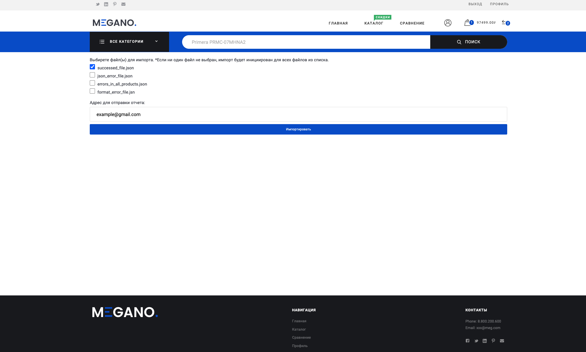
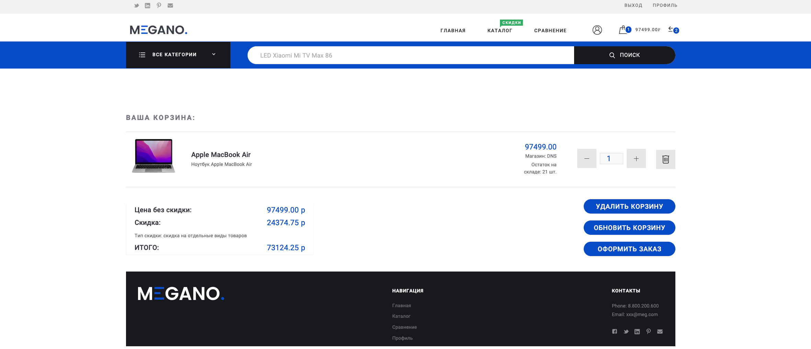

# E-commerce platform
The marketplace platform with ability to register as a seller, export goods and start selling them.
## Navigation
  * [What can it do?](#what-can-it-do?)
  * [Getting started](#getting-started)
      * [Installation](#installation)
  * [Pages screenshots](#pages-screenshots)
    * [Main page](#main-page)
    * [Catalog](#catalog-page)
    * [Product](#product-page)
    * [Comparison page](#comparison-page)
    * [Profile page](#profile-page)
    * [Discount page](#discount-page)
    * [Import page](#import-page)
    * [Cart page](#cart-page)
    * [Order page](#order-page)
  * [Database layout](#database-layout)

# What can it do?

**Key endpoints that are available for users**
```/ru/``` or ```/en/``` - main page <br>
```/ru/catalog/``` - products catalog <br>
```/ru/product/``` - product features <br>
```/ru/comparison/``` - product comparison feature <br>
```/ru/profiles``` - user profile <br>
```/ru/importdata/``` - products import service <br>
```/ru/cart/``` - user cart <br>
```/ru/discounts/``` - available sales <br>
```/ru/order/``` - order and pay <br>
```etc``` <br>


# Getting started

## Installation
1. Install [Python v3.10.](https://docs.python.org/3.10/)
2. Install [Docker](https://docs.docker.com/engine/install/)
3. Install [poetry](https://python-poetry.org/) for packaging and dependency management.
4. Clone this repo and `cd` into it;
5. Activate virtual environment
    ```shell
    poetry config virtualenvs.in-project true &&
    poetry install
    poetry shell
    ```
6. Copy `env.dist` to `.env` (with dot);
    ```yaml
    DATABASE_URL = URL
    REDIS_URL = URL
    SECRET_KEY = "django-insecure-=e-i4d_qq&ra7un4)ugfgdr#gf08q)gc_*yyy4@7--kt(0(p#!("
    DEBUG = True
    ALLOWED_HOSTS = www.allowed.com www.host.com
    EMAIL_HOST = "smtp.gmail.com"
    EMAIL_HOST_USER = "example@gmail.com"
    EMAIL_HOST_PASSWORD = "example password"
    ```
7. Run Docker containers:
    ```shell
    docker run --name postgres_db -e POSTGRES_USER=$POSTGRES_USER -e POSTGRES_PASSWORD=$POSTGRES_PASSPORT -e POSTGRES_DB=$POSTGRES_DB -p 5431:5432 -d postgres &&
    docker run --name redis-db -d -p 6379:6379 redis
    ```
8. Execute the following commands:
   ```shell
   python manage.py makemigrations && python manage.py migrate &&
   python manage.py add_groups &&
   python manage.py loaddata fixtures/* &&
   python manage.py compilemessages && python manage.py makemessages -a -e html,txt,py,jinja2
   ```
9. Run Celery, Celery-beat and Flower in different terminals:
   ```shell
   # if Linux
   celery -A config worker --loglevel=INFO 
   # if ОС Windows
   celery -A config worker --loglevel=INFO --pool=solo
   ````
   ```shell
   celery -A config beat -l INFO
   ```
   ```shell
   celery -A config flower --loglevel=INFO
   ```
10. Run a web server from folder `market/`:
   ```shell
   python manage.py runserver 0.0.0.0:8000
   ```

# Pages screenshots
### Main page


### Catalog page
Catalog with filters


### Product page


### Comparison page


### Profile page


### Discount page


### Import page


### Cart page


### Order page


# Database layout
